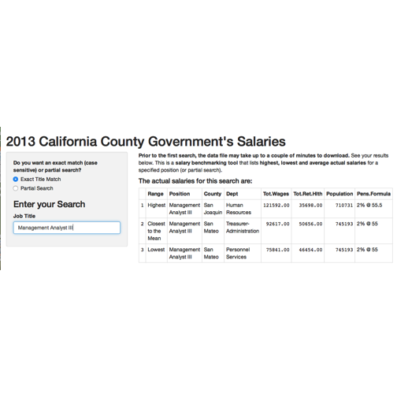

Salary Benchmark Tool 
=======
author: Joy Flowers
date: December, 2015
font-import: http://fonts.googleapis.com/css?family=Helvitica
font-family: 'Helvitica'

Introducing a salary benchmarking tool that lists <i>highest, lowest and 
average actual salaries</i> by job title (or partial search). This tool lists salary information for employees of all <i>California County governments</i> using the most current public data available.

Problem 
========================================================

There is not a tool that is quick and easy to use that gives good salary information. 

 - 
Payscale.com and glassdoor.com give salary information only after you have given them a mound of personal data including your own salary information. The process is time-consuming and a bit invasive and then you get something that shows where you fall into the mix of those who have entered similar information. How do you really know that the information others have entered is correct? Also you only can look at one position.

 - 
Other tools like Vault.com require you to pay monthly for the service. 

 - 
The Bureau of Labor Statistics gives salary information but it is consolidated into occupational groups, so it is not listed anywhere near the job position level. 

 - 
Government published sites such as TransparentCalifornia.com give detailed data but then you have to do your own analysis with the thousands of records it produces for your query.

Solution
========================================================

This solution calculates the highest, lowest and average actual salary for all California government County workers by position or partial search. These salaries are official records reported to the State Controller’s office, so they are accurate. The raw export data comes from <a  href="http://publicpay.ca.gov">publicpay.ca.gov</a>. This information is consistent with what is displayed in <a href="http://www.TransparentCalifornia.org">
TransparentCalifornia.org</a> but this tool lists additional information such as county department, total pay and total retirement/health benefit contributions and best of all, it is quick and easy and does the calculations for you. 

Features and Drawbacks
===================
left: 50%

Features

><li>
Easy to Use
</li>
<li>
Flexible - can add State, City 
   or Other Data for Comparison
</li>
<li>
Partial Word Search
</li>
<li>
Accurate, Reliable Data
</li>
<li>
It's Free and no Personal Information is required
</li>
***

Drawbacks

<li>
Gives Summary Information Only
</li>
<li>
Does not provide private sector data
</li>
<li>
Limited to California, USA data
</li>

Example and Conclusion
===================
 
 

The way to experience this tool is to try it LIVE: Go to <a  href="https://joyflowers.shinyapps.io/SalInfo">https://joyflowers.shinyapps.io/SalInfo</a> to try it now.

This presentation has been viewed 1 times.

